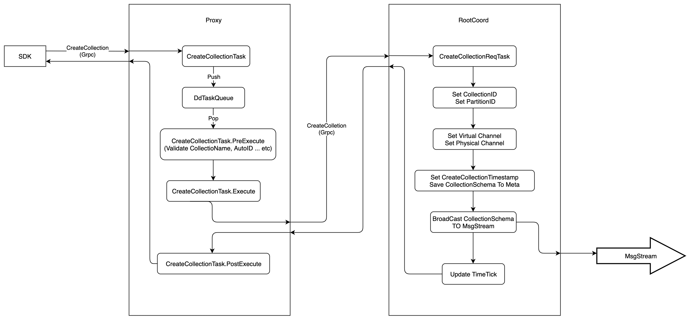

# metaSnapShot

`metaSnapShot` enable `RootCoord` to query historical meta base on timestamp, it provide `Key-Vaule` interface. Take a example to illustrate what `metaSnapShot`. The following figure show a series of operations happened on the timeline.


| Timestamp | Operation |
|-----------|-----------|
| 100       | Set A=1   |
| 200       | Set B=2   |
| 300       | Set C=3   |
| 400       | Set A=10  |
| 500       | Delete B  |
| 600       | Delete C  |

Now assuming the Wall-Clock is `Timestamp=700`, so the `B` should have been deleted from the system, But I want to know what's the value of `B` at `Timesamp=450`, how to do it? `metaSnapShot` is invented to solve this problem.

We need to briefly introduce `etcd`'s `MVCC` before `metaSnapShot`, here is the test program.

```go
package etcdkv

import (
	"context"
	"testing"
	"time"

	"github.com/stretchr/testify/assert"
	"go.etcd.io/etcd/clientv3"
)

func TestMVCC(t *testing.T) {
	addr := []string{"127.0.0.1:2379"}
	cli, err := clientv3.New(clientv3.Config{Endpoints: addr})
	assert.Nil(t, err)
	assert.NotNil(t, cli)
	ctx, cancel := context.WithTimeout(context.Background(), 10*time.Second)
	defer cancel()
	testKey := "test-key"

	rsp0, err := cli.Delete(ctx, testKey)
	assert.Nil(t, err)
	t.Logf("revision:%d", rsp0.Header.Revision)

	rsp1, err := cli.Put(ctx, testKey, "value1")
	assert.Nil(t, err)
	t.Logf("revision:%d,value1", rsp1.Header.Revision)

	rsp2, err := cli.Put(ctx, testKey, "value2")
	assert.Nil(t, err)
	t.Logf("revision:%d,value2", rsp2.Header.Revision)

	rsp3, err := cli.Get(ctx, testKey, clientv3.WithRev(rsp1.Header.Revision))
	assert.Nil(t, err)
	t.Logf("get at revision:%d, value=%s", rsp1.Header.Revision, string(rsp3.Kvs[0].Value))

}
```

The output of abrove test program should looks like this:
```text
=== RUN   TestMVCC
    etcd_mvcc_test.go:23: revision:401
    etcd_mvcc_test.go:27: revision:402,value1
    etcd_mvcc_test.go:31: revision:403,value2
    etcd_mvcc_test.go:35: get at revision:402, value=value1
--- PASS: TestMVCC (0.01s)
```

In the `etcd`, each write operation would let `Revision` add by `1`, so if we specify the `Revision` value at query, we can get the historical value under that `Revision`.

`metaSnapShot` is base on this feature of `etcd`, We will write an extra `Timestamp` on each write operation. `etcd`'s `Txn` make sure that the `Timestamp` would have the same `Revision` with user data.

When querying, `metaSnapShot` will find an appropriate `Revision` base on the input `Timestamp`, and then query on `etcd` with this `Revision`. 

In order to speed up to find `Revision` by `Timestamp`, `metaSnapShot` would maintain a array which mapping the `Timesamp` to `Revision`, the default lenght of this array is `1024`, it's a type of circular array.


- `maxPos` points to the position where `Timestamp` and `Revision` are maximum.
- `minPos` pionts to the position where `Timestamp` and `Revision` are minimun.
- For each update operation, we first add `1` to `maxPos`, so the new `maxPos` would cover the old `minPos` postion, and then add `1` to the old `minPos`
- From `0` to `maxPos` and from `minPos` to `1023`, which are two incremental arrays, we can use binary search to quickly get the `Revision` by to the input `Timestamp`
- If the input `Timestamp` is greater than the `Timestamp` where the `maxPos` is located, then the `Revision` at the position of the `maxPos` will be returned
- If the input `Timestamp` is less than the `Timestamp` where `minPos` is located, `metaSnapshot` will load the historical `Timesamp` and `Revision` from `etcd` to find an appropriate `Revision` value.

The interface of `metaSnapShot` is defined as follow.
```go
type SnapShotKV interface {
	Load(key string, ts typeutil.Timestamp) (string, error)
    LoadWithPrefix(key string, ts typeutil.Timestamp) ([]string, []string, error)

	Save(key, value string) (typeutil.Timestamp, error)
	MultiSave(kvs map[string]string, additions ...func(ts typeutil.Timestamp) (string, string, error)) (typeutil.Timestamp, error)
	MultiSaveAndRemoveWithPrefix(saves map[string]string, removals []string, additions ...func(ts typeutil.Timestamp) (string, string, error)) (typeutil.Timestamp, error)
}
```

For the `Read` operations, `Load` and `LoadWithPrefix`, the input parameter `typeutil.Timestamp` is used to tell `metaSnapShot` to load the value base on that `Timestamp`.

For the `Write` operations, `Save`,`MiltiSave` and `MultiSaveAndRemoveWithPrefix`, the return values includes `typeutil.Timestamp` which used to tell the caller when these write operations happened.

You might be curious about the parameter of `additions` on the `MultiSave` and `MultiSaveAndRemoveWithPrefix`, what does `additions` do, and why?

`additions` is array of  `func(ts typeutil.Timestamp) (string, string, error)`, so it's a function, receiving `typeutil.Timestamp` as an input, and retuns two `sting` which is `key-value` pair, if `error` is `nil` in the return value, `metaSnapShot` would write this `key-value` pair into `etcd`.

Refer to the document of `CreateCollection`, the `Collection`'s create timestamp, is the timestamp when the `Collection`'s meta have been writen into `etcd`, not the timestamp when `RootCoord` receives the request. So before writes the `Collection`'s meta into `etcd`, `metaSnapshot` would allocate a timestamp, and call all the `additions`, this would make sure the create timestamp of the `Collection` is correct.




